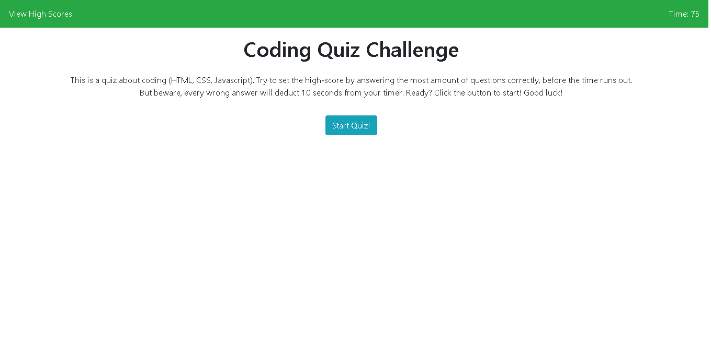
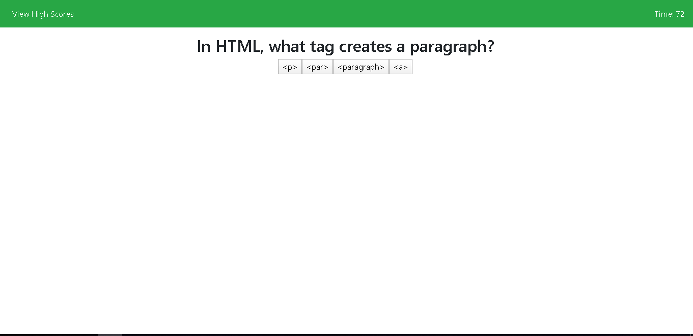
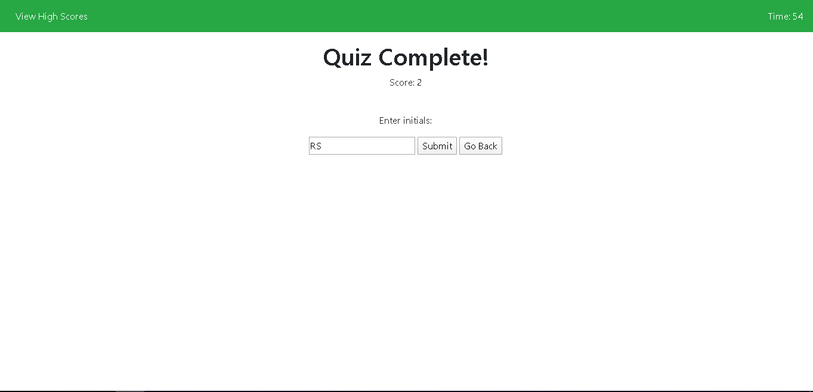
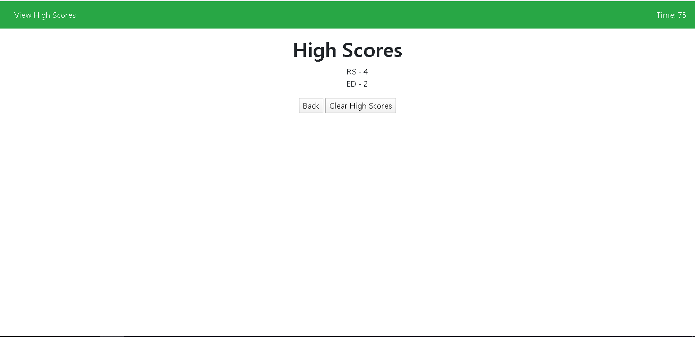

# Code Quiz

 This is the 4th homework assignment for Carleton University's coding boot camp. It is a Code Quiz based on javascript, HTML, and CSS. Built with HTML ... CSS ... and Javascript

Intro Screen

Quiz Screen

Submit High Score / Quiz End Screen

High Score / Leaderboards Screen

